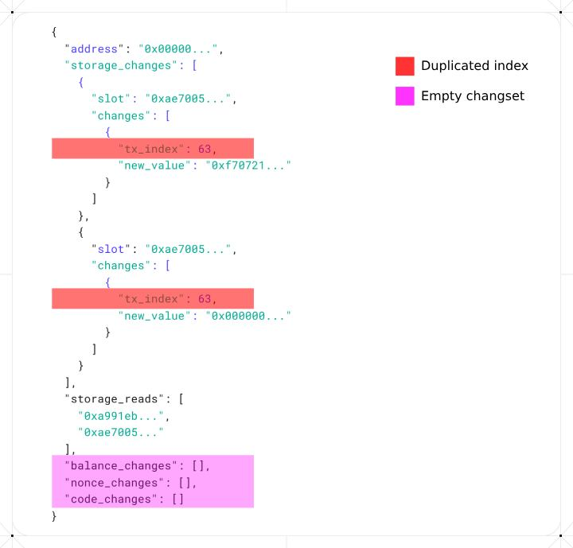

# A compact BAL encoding

TODO: stat
TLDR: A compact BAL encoding cuts size by **≈ X %** with no loss of information.

## Introduction

The current schema suffers from two main inefficiencies:

1. **Duplicate transaction indices** – the transaction index is repeated for every field of every touched account.

2. **Null overhead** – Most transactions do not touch every account field, so empty change‑sets add unnecessary bytes.

This overhead is especially noticeable in read‑only operations such as `EXTCODEHASH`, which populate none of the account fields.



For the analyzed block range about **68%** transactions accessed only 1 field.

| Fields touched in header | Share of transactions |
| ------------------------ | --------------------- |
| 1 field                  | **68.4 %**            |
| 2 fields                 | **31.5 %**            |
| 3 fields                 | **0.1 %**             |
| All 4 fields             | **0.0 %**             |

## A compact BAL schema

> A Block Access List as a **structured collection** of all account interactions—reads, state updates, and deletions—performed by transactions in a block.

Visual layout:

```sh
BlockAccessList
  └─ Account
      └─ Transaction
          └─ Interaction
```

Each `Interaction` captures side-effects of a transaction:

```go
   Interaction :=
    NonceUpdate(newNonce)
  | BalanceUpdate(newBalance)
  | CodeUpdate(bytecode)
  | StoragesUpdates[(slotKey, newValue)+]
  | StorageRead[slotKey+]
  | AccountDeleted
```

- `NonceUpdate`, `BalanceUpdate`, `CodeUpdate`, and `StorageUpdate` interactions store the post-state values.
  StorageRead explicitly lists accessed slots without `value` updates.
- `AccountDelete` flags account removal, clearly distinguishing deletion from field resets.

These interactions are first grouped by transactions, then by account, and finally aggregated at block level:

```go
TransactionInteractions := (txIndex, [Interaction]+)
TouchedAccount := (address, [TransactionInteractions]+) // account-level
BlockAccessList := [TouchedAccount]+ // block-level
```

## SSZ Schema

Formal ssz definition of the proposed schema:

```py
# --- CONSTANTS ---
MAX_TXS = 30_000
MAX_SLOTS = 300_000
MAX_ACCOUNTS = 300_000
MAX_CODE_SIZE = 24_576  # Maximum contract bytecode size in bytes
MAX_INTERACTIONS = 6 # Maximum kind of interaction for an account as defined by Interaction type below


# --- Base Type ---
Address = Bytes20  # 20-byte Ethereum address
StorageKey = Bytes32  # 32-byte storage slot key
StorageValue = Bytes32  # 32-byte storage value
Bytecode = List[byte, MAX_CODE_SIZE]  # Variable-length contract bytecode
TxIndex = uint16  # Transaction index within block (max 65,535)
Balance = uint128  # Post-transaction balance in wei (16 bytes, sufficient for total ETH supply)
Nonce = uint64  # Account nonce
AccountDeleted = Boolean

StorageWrite = Container[
    StorageKey
    StorageValue
]

StorageUpdates = List[StorageWrite, MAX_SLOTS]
StorageReads   = List[StorageKey, MAX_SLOTS]

Interaction = Union[
    Nonce,                 # Nonce Update
    Balance,               # Balance Update
    Bytecode,              # Code Update
    StorageUpdates,        # Storage Update
    StorageReadList,       # Storage Read
    AccountDeleted         # Account Deletion
]

TransactionInteractions = Container[
    TxIndex,
    List[Interaction, MAX_INTERACTIONS]
]

TouchedAccount = Container[
    Address,
    List[TransactionInteractions, MAX_TXS]
]

BlockAccessList = Container[
    List[TouchedAccount, MAX_ACCOUNTS]
]
```

## Analysis

XX blocks were analyzed to compare between the baseline schema with the proposed one.

## Methodology

TODO:

- Blocks: `range(20615532, 20616032, 10)`: Total 50 blocks, with an interval of 10.
- Baseline ssz generated using [eth-bal-analysis](https://github.com/nerolation/eth-bal-analysis/tree/5840b380b0764b3005dcc61937ef2bc4ae4f4f98) tool.
- Compressed each BAL with Snappy; measured byte size; recorded CSV.
- Scripts and raw data live in analysis/ for reproducibility.

## Recommendation: Version and compression bytes

Consider reserving a one‑byte version field at the head of the BAL blob so clients can distinguish between updates and determine the schema to be used for ssz decoding.

```sh
VERSION_BYTE || ssz(BlockAccessList)

```

This can also be extended further to encode compression information byte

```sh
VERSION_BYTE || COMPRESSION_BYTE || ssz(BlockAccessList)
```

| Byte                 | Value | Meaning           |
| -------------------- | ----- | ----------------- |
| **VERSION_BYTE**     | 0x00  | Draft (this spec) |
|                      | 0x01  | Initial release   |
| **COMPRESSION_BYTE** | 0x00  | Uncompressed      |
|                      | 0x01  | Snappy‑compressed |
