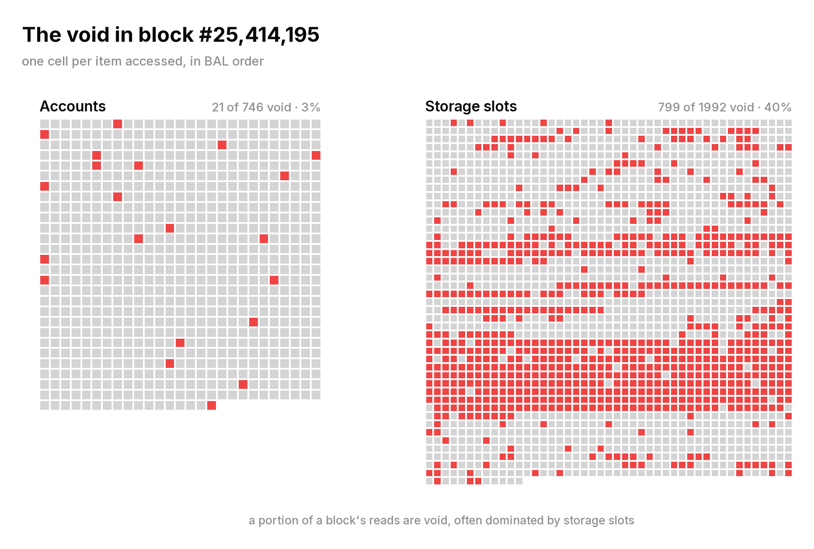
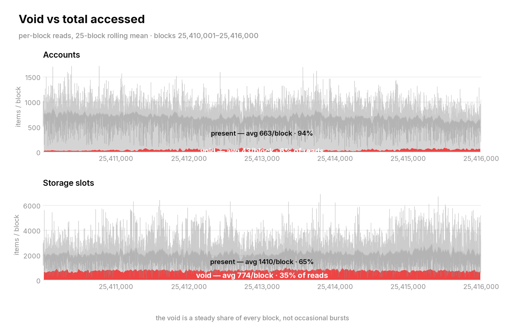
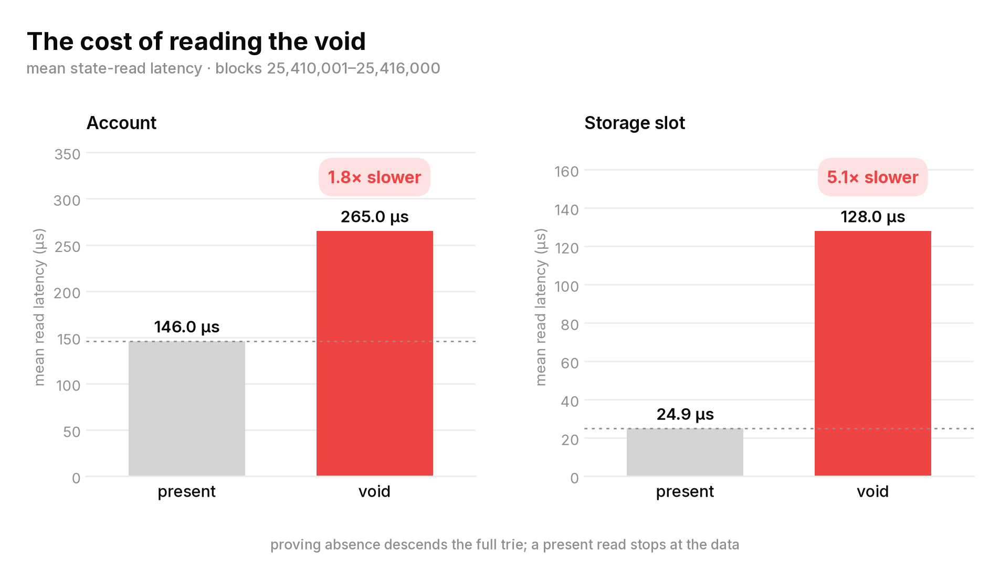
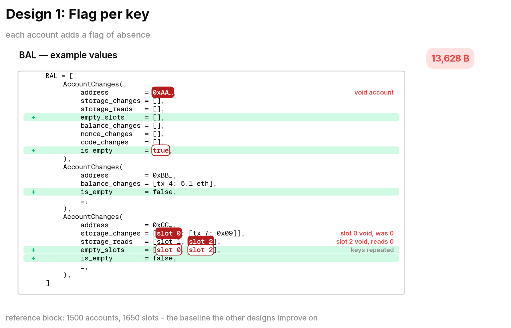
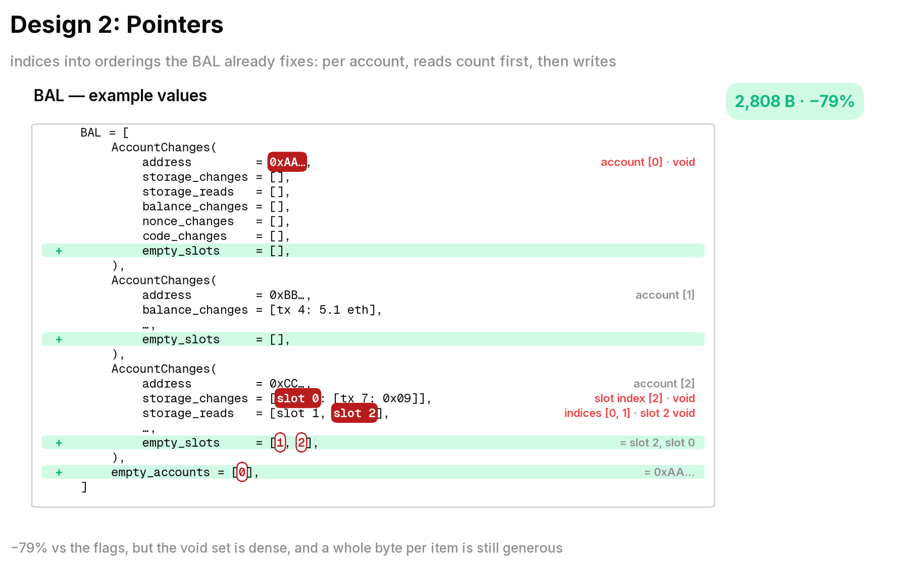
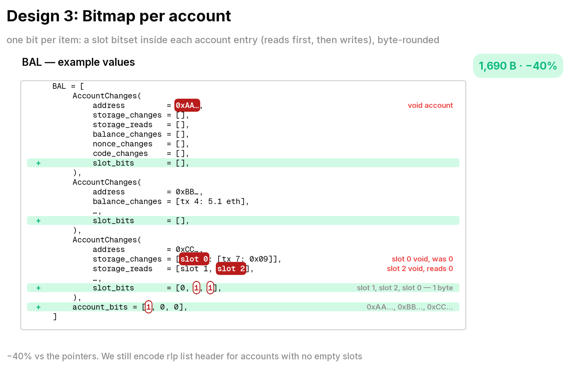
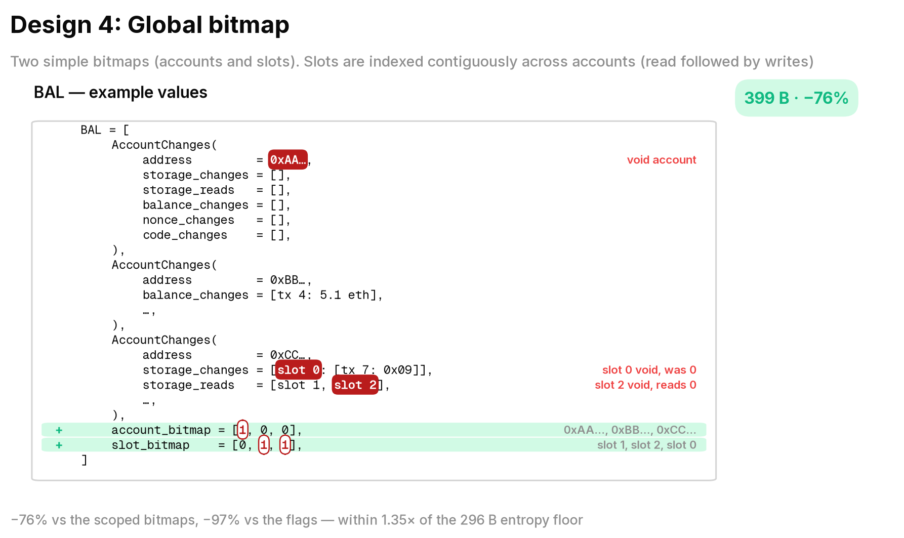
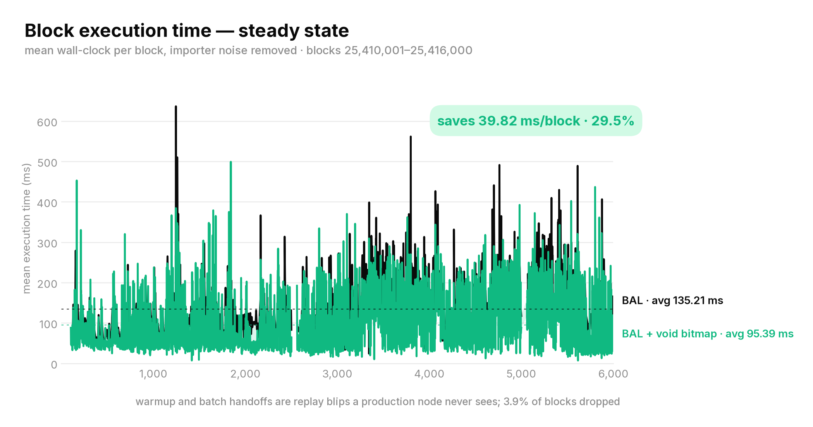
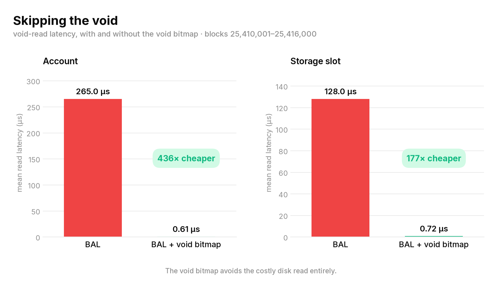
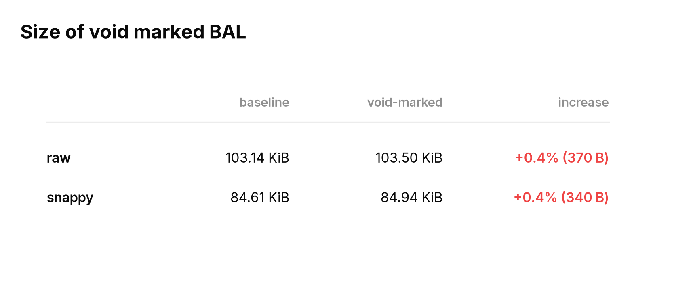

# Mapping the void

## TL;DR

**Over a quarter** of a typical block's execution time is spent chasing data that does not exist.
These lookups are **over five times slower** because proving a value is absent requires descending
to the bottom of the trie and coming back empty-handed.

Marking absent entries in Block Access Lists (BAL) increases their size by only **0.4%** and
avoids most of this work during block validation.

## The void

A block with a median state access pattern is shown below.

Notice the large number of lookups that return void (marked red) - dominated by missing storage
slots, while missing accounts are comparatively rare.

This pattern is consistent across blocks. On average, **6%** of account lookups and **35%** of
storage lookups return void (Appendix A).

The next question is whether these failed lookups are cheap.

## The cost of proving absence

Reading a void is decisively slower than reading real data — modestly for accounts (**1.8x**),
dramatically for storage (**5.1x**). Proving a slot is absent means descending the trie to the
bottom and coming back empty-handed; fetching an existing slot short-circuits as soon as
it's found.

## Encoding the void

A synthetic mainnet-shaped block (1,500 accounts, 1,650 storage slots) was chosen to
design the encoding.

**1. One flag per key.** The obvious representation is one flag per key indicating whether
the lookup returned void.

**2. Replace flags with indexes.** Scattered flags can be compressed into indexes.
Empty accounts are indexed once at the BAL root. Empty storage is indexed within each account.
Since storage reads and writes are mutually exclusive, they share a single BAL-ordered sequence
(reads followed by writes). A single index is therefore sufficient for every empty storage lookup.
This reduces the encoding size by **79%**.

**3. Pack the indexes into bitmaps.** The indexed information is purely boolean and can be packed into a bitmap.
Eight flags fit in a byte, reducing the encoding by another **40%**.

**4. Two global bitmaps.** The per-account storage bitmap still wastes space. An account touching one or two slots
still occupies a full byte, along with an RLP field header. Packing the bits across account boundaries removes
this overhead. The result is two global bitmaps at the BAL root: one for accounts and one for storage.

This is exactly what the [heatmap above](#the-void) represents.

**399 bytes**, a **76%** reduction compared to the per-account bitmap, and **97%** smaller than
the baseline flag-based design.

The final design is as small as a bitmap can be:

* Accounts bitmap: `ceil(1500 / 8)` = **188 bytes**
* Storage bitmap: `ceil(1650 / 8)` = **207 bytes**

Total bitmap payload: **188 + 207 = 395 bytes**. The remaining **4 bytes** are RLP header overhead.

| Encoding | Cost | Reduction vs. baseline |
|----------|-----:|-----------------------:|
| One flag per key | 13.6 kB | — |
| Indexed flags | 2.8 kB | 79% |
| Per-account bitmaps | 1.7 kB | 87% |
| Two global bitmaps | **399 B** | **97%** |

## Skipping the void

Void-marked BAL reduces mean block execution time by **29.5%** across the analysed mainnet range.

The improvement comes from skipping expensive trie traversals for absent state.
Mean state read latency falls by **436x** for account lookups and **177x** for storage lookups.

The optimization comes at almost no cost. Recording void entries increases BAL size by only 0.4%.

