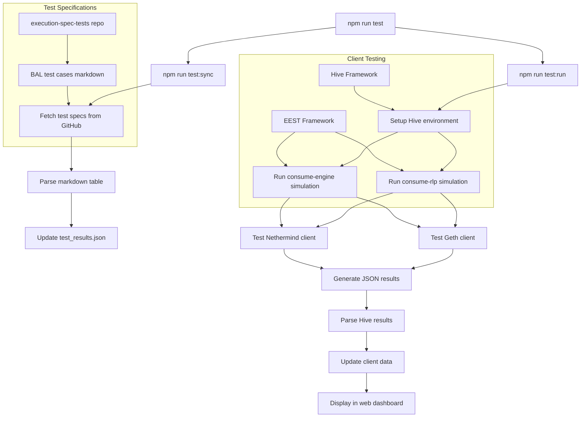

# Technical summary of the adoption tracker

## Why

The adoption tracker provides concrete, testable milestones for BAL implementation across Ethereum execution clients. This approach offers a more transparent way to communicate where things stand, showing objective progress rather than relying on vague status updates. It makes the adoption process easier to follow for both core developers and the broader community.

## The testing infrastructure

The tracker uses two testing frameworks that handle Ethereum client validation. The Ethereum Execution Spec Tests (EEST) framework generates standardized test cases. Written in Python, EEST creates JSON test fixtures that define expected behavior for protocol features. These tests use transition tools from various clients to create reference implementations, allowing all clients to validate against the same test cases.

Hive provides a common interface for testing across different client implementations. It uses "simulators" that launch clients and execute test logic against them.

## How it works

Running `npm run test` executes a two-phase process that coordinates between multiple systems. The command runs both sync and test phases sequentially, ensuring the latest test specifications are used before execution begins.

### Phase 1: Test specification sync

The first phase, `npm run test:sync`, reaches out to the [canonical plain text test cases](https://github.com/ethereum/execution-spec-tests/blob/main/tests/amsterdam/eip7928_block_level_access_lists/test_cases.md) for BAL testing. The `sync-test-cases.ts` script fetches a structured markdown file from the execution-spec-tests repository that contains a table defining each test case. This table includes columns for function names, test goals, setup requirements, and expected outcomes. All test cases are initialized with "pending" status across all client implementations and simulation types.

### Phase 2: Test execution

The second phase, `npm run test:run`, orchestrates the actual testing through the Hive framework. The `run-integration-tests.ts`

The system executes two distinct simulation types sequentially. The consume-rlp simulation tests how clients handle RLP import of blocks. The consume-engine simulation validates Engine API integration, testing how execution clients interact with consensus layer components through the standardized engine interface.

Each simulation launches containerized versions of configured Ethereum clients. The system reads client configurations from `hive_clients.yml`, which specifies Docker build parameters and GitHub repository information for each client.

Hive executes tests with specific filtering to focus on BAL-related functionality. The test filter `tests/amsterdam/eip7928_block_level_access_lists` ensures only relevant tests run, while parallelism settings optimize execution time. Results are captured in JSON format within the `.hive` directory.

## Data processing and results

After each simulation completes, the `parse-hive-results.ts` script processes the raw Hive output into simple json files for the UI to consume.

The system maintains two key data files throughout this process. The `test_results.json` file contains the complete test database with results for each client and simulation type. The `clients.json` file tracks client metadata including versions and GitHub repository links.

## Technical resources

The system builds on established Ethereum testing infrastructure. The [Hive testing framework](https://github.com/ethereum/hive/blob/master/docs/overview.md) provides documentation for cross-client testing. The [Execution Spec Tests repository](https://github.com/ethereum/execution-spec-tests) shows how test cases are developed and maintained. The guide for [running EEST tests with Hive](https://eest.ethereum.org/main/running_tests/hive/) demonstrates framework integration, while [current BAL test cases](https://github.com/ethereum/execution-spec-tests/blob/main/tests/amsterdam/eip7928_block_level_access_lists/test_cases.md) show the specific functionality being validated.
